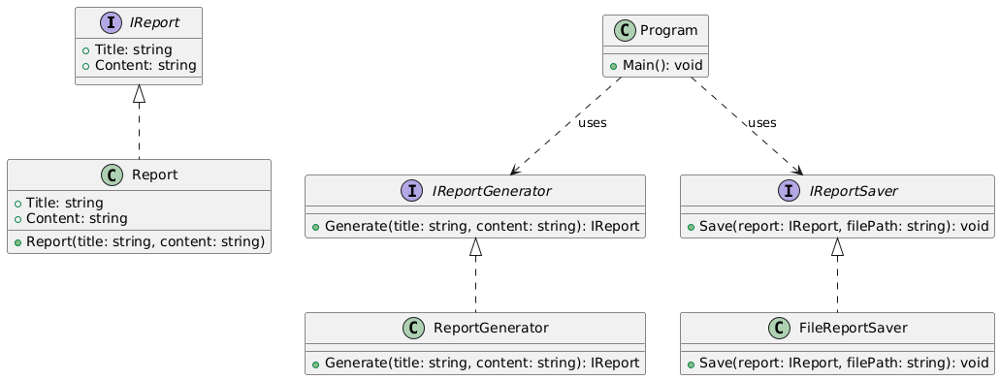

<h1>Report Generator</h1>

<h2>Overview</h2>

This is a sample project that demonstrates how to design and develop a simple
report and invoice generator using sound object-oriented programming principles.
The project follows the <strong>Single Responsibility Principle (SRP)</strong> from
the SOLID design principles, ensuring that each class has only one reason to change.

The solution is organized into multiple projects:

<ul>
  <li><strong>Execute</strong>: The console application entry point (<code>Program.cs</code>) that orchestrates the workflow.</li>
  <li><strong>Reports</strong>: A class library that defines the core abstractions and implementations for reports, report generation, and saving.</li>
  <li><strong>ReportGenerator.Tests</strong>: A unit test project that validates the behavior of the system.</li>
</ul>

<h2>Design</h2>

<h3>Modules in this project</h3>
<ul>
  <li><strong>Reports</strong>
    <ul>
      <li><code>IReport</code>: Interface representing a report with a title and content.</li>
      <li><code>Report</code>: Concrete implementation of <code>IReport</code>.</li>
      <li><code>IReportGenerator</code>: Interface for generating reports.</li>
      <li><code>ReportGenerator</code>: Generates reports based on input.</li>
      <li><code>IReportSaver</code>: Interface for saving reports.</li>
      <li><code>FileReportSaver</code>: Saves reports to a file.</li>
    </ul>
  </li>
  <li><strong>Execute</strong>
    <ul>
      <li><code>Program</code>: The console application entry point. It uses <code>IReportGenerator</code> to create reports and <code>IReportSaver</code> to save them.</li>
    </ul>
  </li>
  <li><strong>Tests</strong>
    <ul>
      <li>Unit tests for <code>Report</code>, <code>ReportGenerator</code>, <code>FileReportSaver</code>, <code>Invoice</code>, and <code>InvoiceGenerator</code>.</li>
    </ul>
  </li>
</ul>

<h2>Project Structure</h2>
<pre>
ReportGenerator/
 ├── Execute/                 
 │    └── Program.cs
 │
 ├── Reports/                 
 │    ├── IReport.cs
 │    ├── Report.cs
 │    ├── IReportGenerator.cs
 │    ├── ReportGenerator.cs
 │    ├── IReportSaver.cs
 │    ├── FileReportSaver.cs
 │    ├── Invoice.cs
 │    └── InvoiceGenerator.cs
 │
 ├── ReportGenerator.Tests/   
      ├── ReportTests.cs
      ├── ReportGeneratorTests.cs
      ├── FileReportSaverTests.cs
      ├── InvoiceTests.cs
      └── InvoiceGeneratorTests.cs
</pre>

<h2>Class Diagram</h2>

The following UML diagram illustrates the design of the system:

<h2>Environment</h2>
<ul>
  <li>.NET 8.0 (Long Term Support)</li>
  <li>Visual Studio 2022 Community Edition (or later)</li>
  <li>MSTest framework for unit testing</li>
</ul>

<h2>Running the Project</h2>
<ol>
  <li>Open the solution in Visual Studio.</li>
  <li>Set <strong>Execute</strong> as the startup project (already configured).</li>
  <li>Build the solution.</li>
  <li>Run the project.
    <ul>
      <li>The console will generate a sample report</li>
    </ul>
  </li>
</ol>

<h2>Running Tests</h2>

From the solution root, run:

<pre><code>dotnet test</code></pre>

This will execute all unit tests in the <code>ReportGenerator.Tests</code> project.
Code coverage can be viewed using the built-in <code>Microsoft.CodeCoverage</code> tool in Visual Studio.

